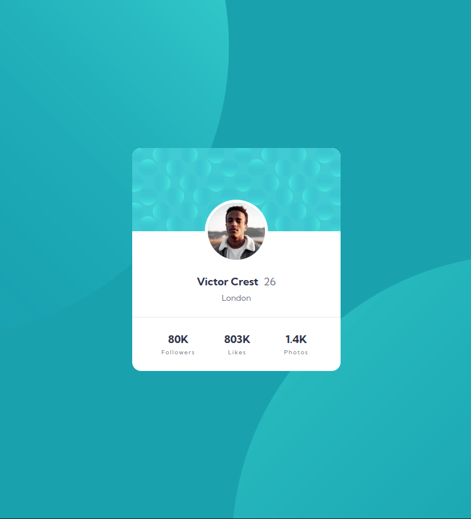

# Frontend Mentor - Profile card component solution

This is a solution to the [Profile card component challenge on Frontend Mentor](https://www.frontendmentor.io/challenges/profile-card-component-cfArpWshJ). Frontend Mentor challenges help you improve your coding skills by building realistic projects.

## Table of contents

- [Overview](#overview)
  - [The challenge](#the-challenge)
  - [Screenshot](#screenshot)
  - [Links](#links)
- [My process](#my-process)
  - [Built with](#built-with)
  - [What I learned](#what-i-learned)
  - [Continued development](#continued-development)
  - [Useful resources](#useful-resources)
- [Author](#author)
- [Acknowledgments](#acknowledgments)

## Overview

### The challenge

- Build out the project to the designs provided

### Screenshot



### Links

- Solution URL: [https://github.com/harnettd/profile-card](https://github.com/harnettd/profile-card)
- Live Site URL: [https://harnettd.github.io/profile-card/](https://harnettd.github.io/profile-card/)

## My process

### Built with

- HTML
- CSS including Flexbox
- Gulp

### What I learned

On this project, I focused on learning organizational tools and techniques that, while certainly overkill here, will be valuable on larger projects. In particular, I split my CSS styles across several Sass files. Furthermore, some styles that I have used repeatedly in other Frontend Mentor projects were put into a separate library.blocks directory similar to how things might be organized in a project that utilized pre-built components. Project-specific styles were placed into a common.blocks directory. Processed CSS was written to a bundles directory. 

Given that the project was split over so many files, it seemed necessary to employ a tool such as Gulp to build it. I wrote a gulpfile that implemented transpiling, CSS concatenation, and minification. For example, to transpile .scss to .css files, I included the following lines of code in a gulpfile:

```js
const sass = require("gulp-sass")(require("sass"));

const common = "common.blocks";

cssTranspile = () => {
    return src(common + "/*.scss")
        .pipe(sass().on("error", sass.logError))
        .pipe(dest(common));
}

exports.cssCat = cssCat;
```

### Continued development

On future Frontend Mentor exercises, I will continue learning how best to modularize and build (larger) projects. Here, I organized my CSS according to the BEM methodology, and I used Gulp for building. There are, of course, alternatives to both such as SMACSS for CSS organization and Grunt for building.

### Useful resources

- [Getting Started with Gulp.js](https://cubettech.com/resources/blog/getting-started-with-gulp-js/) - This webpage helped me install Gulp, write a gulpfile, and use Gulp to build my project.

## Author

- Website - [https://github.com/harnettd](https://github.com/harnettd)
- Frontend Mentor - [@harnettd](https://www.frontendmentor.io/profile/harnettd)

## Acknowledgments

Thanks to [Frontend Mentor](https://www.frontendmentor.io/) for posting this exercise.
